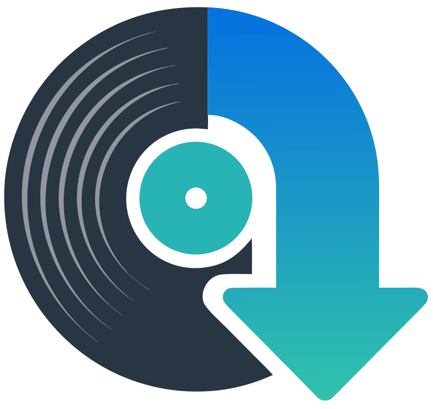
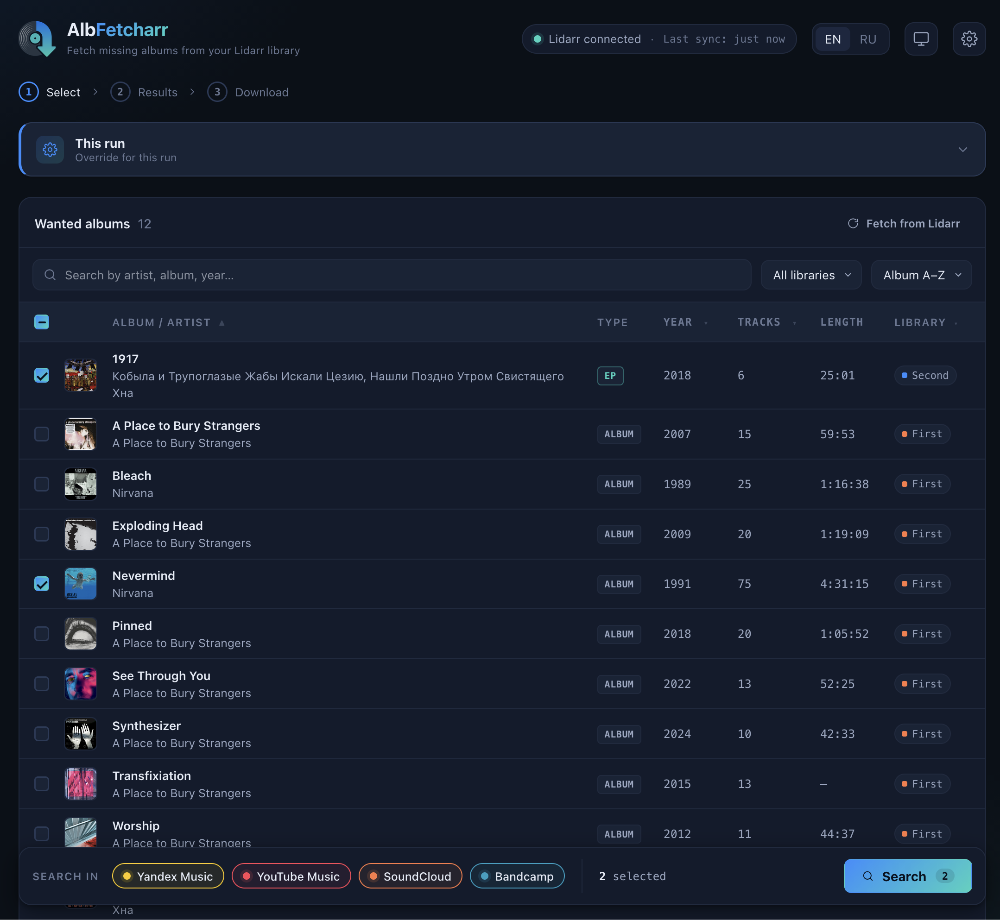
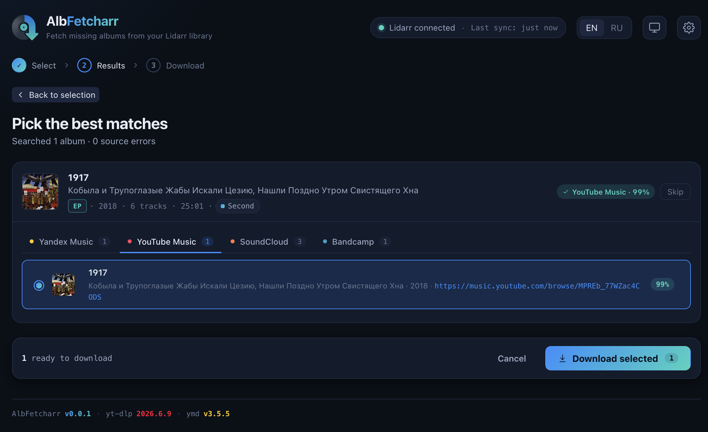
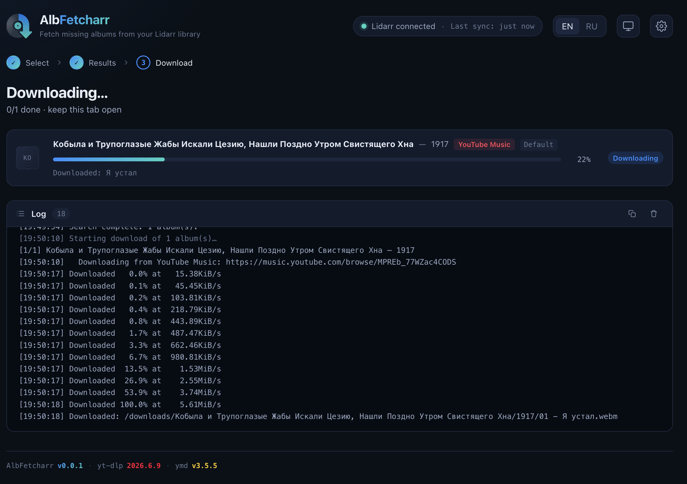

# AlbFetcharr



A web service that fetches [Lidarr](https://lidarr.audio/)'s **wanted** albums
from [Yandex Music](https://music.yandex.ru/),
[YouTube Music](https://music.youtube.com/),
[SoundCloud](https://soundcloud.com/), and [Bandcamp](https://bandcamp.com/),
then imports them back into Lidarr. Built around a pluggable source model.

AlbFetcharr complements Lidarr: Lidarr tracks what you're missing and owns the
library; AlbFetcharr is the fetcher that fills the gaps from streaming sources
and hands the results back via Lidarr's ManualImport.

## Features

- **Wanted list** — pulls albums with status *Missing* straight from the Lidarr API
- **Multi-source search** — Yandex Music, YouTube Music, SoundCloud, and Bandcamp
  behind one pluggable source model; pick which sources to search per run
- **Quality / format choice** — per-album selection of the best match and the
  download quality/format before fetching
- **Download with live progress** — per-album progress bars and a terminal log,
  via [yandex-music-downloader](https://github.com/llistochek/yandex-music-downloader)
  (Yandex) and [yt-dlp](https://github.com/yt-dlp/yt-dlp) (the rest)
- **Automatic import** — ManualImport into Lidarr plus cover-art copy next to the
  imported album (partial imports are surfaced, not failed)
- **Three-step web UI** — Select → Results → Download, with light/dark/system
  themes and EN/RU localization
- **CLI mode** — the same `wanted` / `download` flows headless, for cron or scripts
- **Persistent settings (optional)** — SQLite store with Fernet-encrypted secrets,
  an in-app settings screen, and a per-run override panel
- **OpenAPI 3** — Scalar / Swagger / Redoc viewers under `/apidoc`

## Screenshots

**1 · Select** — load your Lidarr wanted list, filter/sort, and pick which sources to search.



**2 · Results** — search across the enabled sources and choose the best match (and quality) per album.



**3 · Download** — fetch with live per-album progress and a terminal log, then auto-import into Lidarr.



---

## This repository — the entry point

This is the **release layer** that ties the product together. It contains no
application source — that lives in two repositories, pinned here as submodules
and built into a single image:

| Submodule    | Source                                                  | Role                            |
|--------------|---------------------------------------------------------|---------------------------------|
| `backend/`   | `semsemyonoff/AlbFetcharr-backend` (Flask API + fetcher)| App; serves API + SPA + CLI on :5000 |
| `frontend/`  | `semsemyonoff/AlbFetcharr-frontend` (React/Vite SPA)    | Built into the image            |

AlbFetcharr ships as **one product version** = **one container** = **one image**
(`semsemyonoff/albfetcharr`). The Vite SPA is built to static assets and baked
into the backend image, which Flask/gunicorn serves alongside the API on port
`5000`. There is no separate frontend container in production.

---

## Self-hosting

You only need this `README`, `docker-compose.yml`, and `.env.example` — not the
submodules.

```bash
cp .env.example .env                       # then configure it (see below)
mkdir -p config downloads library          # persistent state, download staging, library
docker compose up -d
```

Open `http://localhost:8080` (or the `ALBFETCHARR_HTTP_PORT` you set), then load
your wanted list and start fetching.

## Configuration

Everything is set in `.env` (copied from `.env.example`). At minimum AlbFetcharr
needs to reach Lidarr and to have at least one usable source.

### 1. Lidarr

```env
LIDARR_URL=http://lidarr:8686
LIDARR_API_KEY=<your key>
```

Get the key in Lidarr under **Settings → General → API Key**. Make sure Lidarr has
wanted albums (status *Missing*). No Download Client setup is needed — AlbFetcharr
imports via Lidarr's ManualImport API. To also wire imports and cover-art copy,
set `ALBFETCHARR_LIDARR_IMPORT_PATH` and `ALBFETCHARR_LIBRARY_MAP` (see
[Directories and library mapping](#directories-and-library-mapping)).

### 2. Sources

At least one source must be usable:

```env
YANDEX_MUSIC_TOKEN=<your token>            # the most accurate source
YANDEX_MUSIC_QUALITY=2                     # 0 AAC 64, 1 AAC 192, 2 FLAC
```

Get a Yandex Music token following
[these instructions](https://yandex-music.readthedocs.io/en/main/token.html).
YouTube Music, SoundCloud, and Bandcamp work without credentials — see
[Sources](#sources) for what each does and for the optional YouTube cookies /
search-OAuth setup.

### 3. Secret key (recommended)

AlbFetcharr can keep its settings — including secrets like the Yandex token and
Lidarr key — in a persistent SQLite store (`/config/albfetcharr.db`), so you can
manage them from the in-app **Settings** screen instead of `.env`. To store
secrets there, the app encrypts them at rest with a Fernet key. Without the key
the app still runs **env-only** (it reads secrets from `.env`; writing secrets to
the DB is refused), so this is optional but recommended if you want to configure
from the UI.

Generate a key:

```bash
python -c "import base64,os; print(base64.urlsafe_b64encode(os.urandom(32)).decode())"
# or, without Python:
openssl rand -base64 32 | tr '+/' '-_'
```

Set it in `.env`:

```env
ALBFETCHARR_SECRET_KEY=<the generated key>
```

> ⚠️ **Back up this key.** If you lose it, secrets already encrypted in the DB
> cannot be recovered — you'd have to re-enter them.

After `docker compose up -d`, open the UI and either keep everything in `.env`, or
fill the remaining settings (including secrets) from the **Settings** screen. For
the complete list of tunables, see [Environment variables](#environment-variables).

### Running alongside Lidarr

AlbFetcharr does not bundle Lidarr — point it at your existing instance. A
combined stack looks like this:

```yaml
services:
  lidarr:
    image: linuxserver/lidarr
    container_name: lidarr
    environment:
      - PUID=1000
      - PGID=1000
    volumes:
      - ./lidarr/config:/config
      - /path/to/music:/data/library
      - /path/to/downloads:/data/downloads
    ports:
      - "8686:8686"
    restart: unless-stopped

  albfetcharr:
    image: semsemyonoff/albfetcharr
    container_name: albfetcharr
    environment:
      - YANDEX_MUSIC_TOKEN=your_token_here
      - YANDEX_MUSIC_QUALITY=2
      - LIDARR_URL=http://lidarr:8686
      - LIDARR_API_KEY=your_api_key_here
      - ALBFETCHARR_LIDARR_IMPORT_PATH=/data/downloads/alb
      - ALBFETCHARR_LIBRARY_MAP=/data/library=/libraries/music
    volumes:
      - ./albfetcharr/config:/config
      - /path/to/downloads/alb:/downloads
      - /path/to/music:/libraries/music
    ports:
      - "8080:5000"
    restart: unless-stopped
```

The provided `docker-compose.yml` ships only the `albfetcharr` service and drives
everything from `.env`; the snippet above shows how it sits next to Lidarr.

### Directories and library mapping

AlbFetcharr works with two kinds of directories:

- **Downloads** — the staging folder where albums are fetched to (mounted at
  `/downloads`). Share it with Lidarr so it can import from there.
- **Libraries** — Lidarr's **root folders**, where Lidarr stores imported music.

Lidarr may use several root folders (e.g. `/data/library` and `/data/soundtracks`),
and the container paths inside Lidarr and inside AlbFetcharr can differ. After an
import, AlbFetcharr asks the Lidarr API for the album's path (a *Lidarr* path) and
copies cover art next to it — so it needs to translate that path to its own view.
That translation is `ALBFETCHARR_LIBRARY_MAP`:

```
ALBFETCHARR_LIBRARY_MAP=<lidarr_path>=<albfetcharr_path>,<lidarr_path2>=<albfetcharr_path2>
```

**Single library:**

| Container   | Path                | Host                |
|-------------|---------------------|---------------------|
| Lidarr      | `/data/library`     | `/mnt/music`        |
| Lidarr      | `/data/downloads`   | `/mnt/downloads`    |
| AlbFetcharr | `/downloads`        | `/mnt/downloads/alb`|
| AlbFetcharr | `/libraries/music`  | `/mnt/music`        |

```
ALBFETCHARR_LIBRARY_MAP=/data/library=/libraries/music
ALBFETCHARR_LIDARR_IMPORT_PATH=/data/downloads/alb
```

**Multiple libraries** — add a mount and a map entry per root folder:

```
ALBFETCHARR_LIBRARY_MAP=/data/music=/libraries/music,/data/soundtracks=/libraries/soundtracks
```

On startup AlbFetcharr checks Lidarr's root folders via the API and warns if any
of them has no mapping entry.

### Sources

AlbFetcharr searches and downloads from four sources behind a pluggable model.
Pick which to search per run; enable/disable them globally in **Settings → Sources**
or via the `ALBFETCHARR_ENABLE_*` variables.

| Source        | Requirement                | Notes                                                                       |
|---------------|----------------------------|-----------------------------------------------------------------------------|
| Yandex Music  | `YANDEX_MUSIC_TOKEN`       | Most accurate search, best metadata; AAC 64/192 or FLAC                      |
| YouTube Music | on by default              | Anonymous search gets bot-gated by YouTube → empty results; OAuth recommended |
| SoundCloud    | on by default              | Sets/playlists; search can be loose, tags may be incomplete                 |
| Bandcamp      | on by default              | Real albums with correct tags; mostly indie/self-releases; free stream is MP3 128 |

- **Yandex Music** — requires a valid auth token; best metadata. Quality via
  `YANDEX_MUSIC_QUALITY` (`0` AAC 64, `1` AAC 192, `2` FLAC).
- **YouTube Music** — search via `ytmusicapi` (anonymous works but gets bot-gated
  → empty results; authenticate with [OAuth](#youtube-music-search-oauth)); per-track
  download via `yt-dlp`. Downloads may need [cookies](#youtube-download-cookies).
  Tracks that stay unavailable are skipped and the album imports **partially**
  (`partial: N/M` in the log; *Partial*, not *Failed*, in the UI).
- **SoundCloud** — search/download via `yt-dlp`; search can be inaccurate, so
  review results before downloading.
- **Bandcamp** — autocomplete-API search (albums only) + `yt-dlp` download with
  real track numbers/tags; mostly indie/self-releases, free stream is MP3 128.

> yt-dlp's YouTube extractor needs a JS runtime (`deno`) and the `yt-dlp-ejs`
> solver to clear YouTube's signature/n-challenge. Both are **baked into the
> image** — nothing to install when self-hosting via Docker.

#### YouTube download cookies

YouTube downloads may require cookies from a signed-in account (the *"Sign in to
confirm you're not a bot"* error). Cookie support is **optional** — without it,
the other sources are unaffected.

1. Export cookies in Netscape format (`cookies.txt`) from a browser signed in to
   YouTube — e.g. the
   [Get cookies.txt LOCALLY](https://github.com/kairi003/Get-cookies.txt-LOCALLY)
   extension or `yt-dlp --cookies-from-browser`.
2. Put the file in your mounted config dir (so it's available to the container as
   e.g. `/config/cookies.txt`) and set `ALBFETCHARR_YTDLP_COOKIES` to that
   **container** path.
3. `docker compose up -d` again. The file is picked up only if it exists.

YouTube *search* does not use these cookies — for that, see OAuth below.

#### YouTube Music search OAuth

Anonymous `ytmusicapi` search eventually gets bot-gated by YouTube — the request
succeeds but **results are empty**. To stop being anonymous, authenticate search
via OAuth. This is **optional**: with no file, search stays anonymous.

You need two things — a **Google OAuth client** (`client_id` + `client_secret`)
and a **token file** (`oauth.json`):

- `client_id` / `client_secret` identify the *application*. They grant no account
  access on their own and aren't handed out as a file — create them once in Google
  Cloud (step 1).
- `oauth.json` is the *sign-in itself*: an `access_token` / `refresh_token` bound
  to your account, generated by Google in exchange for the client id/secret plus a
  browser authorization (step 2). It self-refreshes and doesn't expire like cookies.

1. **Create an OAuth client.** In the
   [Google Cloud Console](https://console.cloud.google.com/) → new project →
   enable **YouTube Data API v3** → *Credentials* → *Create credentials* →
   *OAuth client ID* → type **TVs and Limited Input devices**. Note the
   `client_id` and `client_secret`.
2. **Generate the token.** On any machine with Python: `pip install ytmusicapi`, then
   ```bash
   ytmusicapi oauth --client-id <CLIENT_ID> --client-secret <CLIENT_SECRET>
   ```
   Authorize in the browser via the printed link. This writes `oauth.json`.
3. **Mount `oauth.json`** at the `ALBFETCHARR_YTMUSIC_OAUTH` path (default
   `/config/ytmusic_oauth.json`) — put it in your config dir. Picked up only if it
   exists; otherwise search stays anonymous.
4. **Give the app the client id/secret** — either add `"client_id"` /
   `"client_secret"` fields to `oauth.json`, **or** set
   `ALBFETCHARR_YTMUSIC_CLIENT_ID` / `ALBFETCHARR_YTMUSIC_CLIENT_SECRET`. Then
   restart the stack.

If the file is broken or missing the client id/secret, search silently falls back
to anonymous (with a warning in the logs). More on the token:
[ytmusicapi OAuth docs](https://ytmusicapi.readthedocs.io/en/stable/setup/oauth.html).

### Environment variables

The essentials for a deployment:

| Variable                          | Default                     | Description                                                  |
|-----------------------------------|-----------------------------|--------------------------------------------------------------|
| `ALBFETCHARR_IMAGE`               | `semsemyonoff/albfetcharr`  | Image repository                                             |
| `ALBFETCHARR_TAG`                 | `latest`                    | Image tag; pin to a release in prod                         |
| `ALBFETCHARR_HTTP_PORT`           | `8080`                      | Host port (container serves on 5000)                        |
| `ALBFETCHARR_CONFIG_DIR`          | `./config`                  | Host dir mounted to `/config` (settings DB, oauth, cookies) |
| `ALBFETCHARR_DOWNLOADS_DIR`       | `./downloads`               | Host dir mounted to `/downloads` (share with Lidarr)        |
| `ALBFETCHARR_LIBRARY_DIR`         | `./library`                 | Host dir mounted to `/libraries/music`                      |
| `LIDARR_URL`                      | —                           | Lidarr base URL (e.g. `http://lidarr:8686`)                 |
| `LIDARR_API_KEY`                  | —                           | Lidarr API key                                              |
| `YANDEX_MUSIC_TOKEN`              | —                           | Yandex Music auth token                                     |
| `YANDEX_MUSIC_QUALITY`            | `2`                         | `0` AAC 64, `1` AAC 192, `2` FLAC                           |
| `ALBFETCHARR_LIDARR_IMPORT_PATH`  | —                           | Download dir as Lidarr sees it (ManualImport)               |
| `ALBFETCHARR_LIBRARY_MAP`         | —                           | `lidarr_path=albfetcharr_path,…` (cover-art copy)           |
| `ALBFETCHARR_SECRET_KEY`          | —                           | Fernet key to encrypt secrets in the settings DB (optional) |
| `TZ`                              | `UTC`                       | Container timezone                                          |

This is the deployment-critical subset. The **complete reference** — every source
toggle, download tweak, network/retry knob, cookies/OAuth path, and the container
`UID`/`GID`/`UMASK` — lives in the
[backend README](https://github.com/semsemyonoff/AlbFetcharr-backend#environment-variables),
which is the app's config contract.

### Volumes

| Container path     | Source (env)                  | Purpose                                            |
|--------------------|-------------------------------|----------------------------------------------------|
| `/config`          | `ALBFETCHARR_CONFIG_DIR`      | Settings DB + optional `ytmusic_oauth.json` / `cookies.txt` |
| `/downloads`       | `ALBFETCHARR_DOWNLOADS_DIR`   | Download staging; shared with Lidarr               |
| `/libraries/music` | `ALBFETCHARR_LIBRARY_DIR`     | Lidarr root folder (cover-art copy after import)   |

### CLI mode

The same fetch flows run headless — useful for cron or one-off grabs:

```bash
# Fetch every wanted album and import into Lidarr
docker compose run --rm albfetcharr wanted

# Fetch without importing
docker compose run --rm albfetcharr wanted --no-import

# Restrict to one source (yandex / youtube_music / soundcloud / bandcamp)
docker compose run --rm albfetcharr wanted --source youtube_music

# Fetch a single album by URL (source auto-detected)
docker compose run --rm albfetcharr download "https://music.yandex.ru/album/12345"

# …with an explicit source
docker compose run --rm albfetcharr download --source soundcloud "https://soundcloud.com/..."
```

### Upgrade

Bump `ALBFETCHARR_TAG` in `.env`, then `make pull && make up`.
Handy commands: `make up` · `make down` · `make pull` · `make logs` · `make ps`.

### Migrating from Yamdarr

If you ran the old `semsemyonoff/yamdarr` image:

1. Change the image to `semsemyonoff/albfetcharr`.
2. Rename `YAMDARR_*` variables to `ALBFETCHARR_*`. Note that the three Yandex
   network knobs were renamed for accuracy (`YAMDARR_TIMEOUT` →
   `ALBFETCHARR_YANDEX_TIMEOUT`, and likewise `…_TRIES`, `…_RETRY_DELAY`), the
   path-pattern variables were removed (the path layout is now fixed in code),
   and `YAMDARR_AUTO_DOWNLOAD` / `YAMDARR_AUTO_CRON` are gone — background
   auto-download was removed; trigger fetches from the UI or CLI.

Unchanged: `LIDARR_URL`, `LIDARR_API_KEY`, `YANDEX_MUSIC_TOKEN`,
`YANDEX_MUSIC_QUALITY`, `DOWNLOAD_DIR`, `UID`, `GID`, `UMASK`.

---

## Disclaimer

This is an independent project, not affiliated with Yandex, Google, or SoundCloud.

Downloading music from the internet may be restricted by copyright law in your
jurisdiction. **You are solely responsible for ensuring your use complies with
local law.** When using YouTube Music and SoundCloud as sources, mind those
services' terms of use — automated downloading via yt-dlp may violate them.
